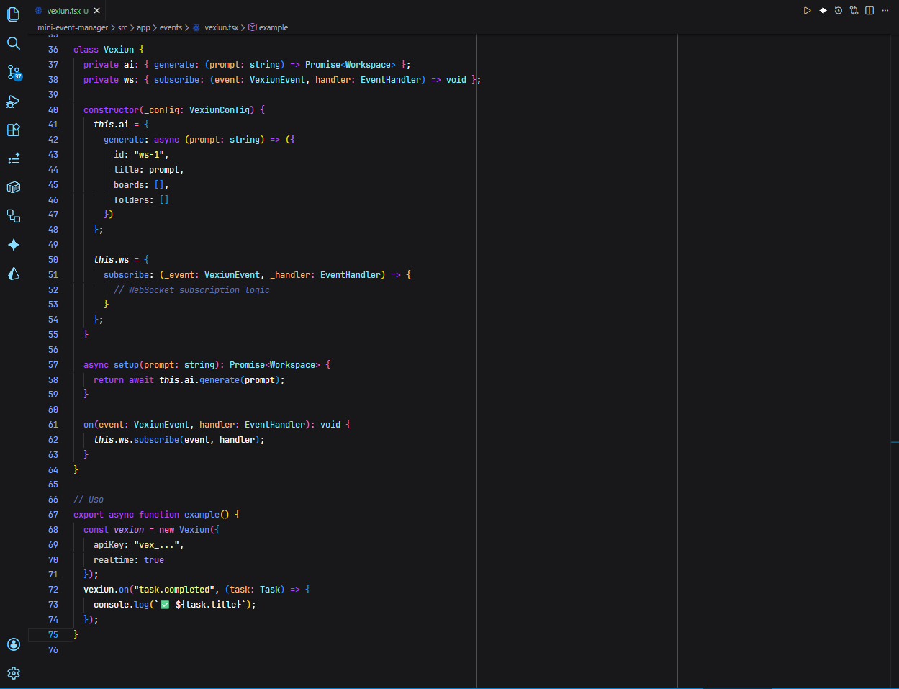
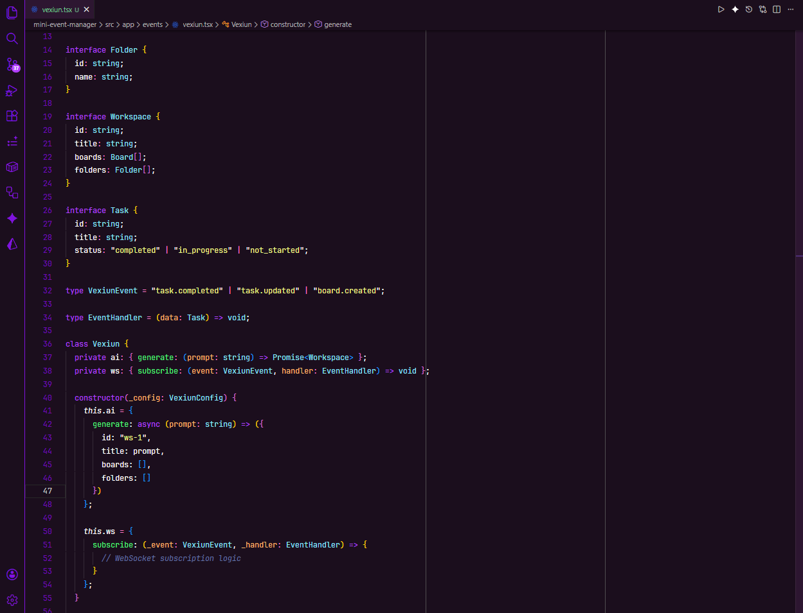
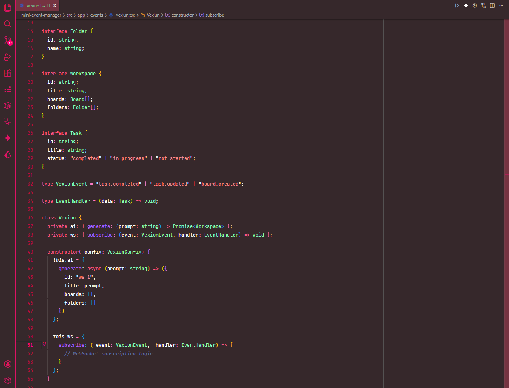
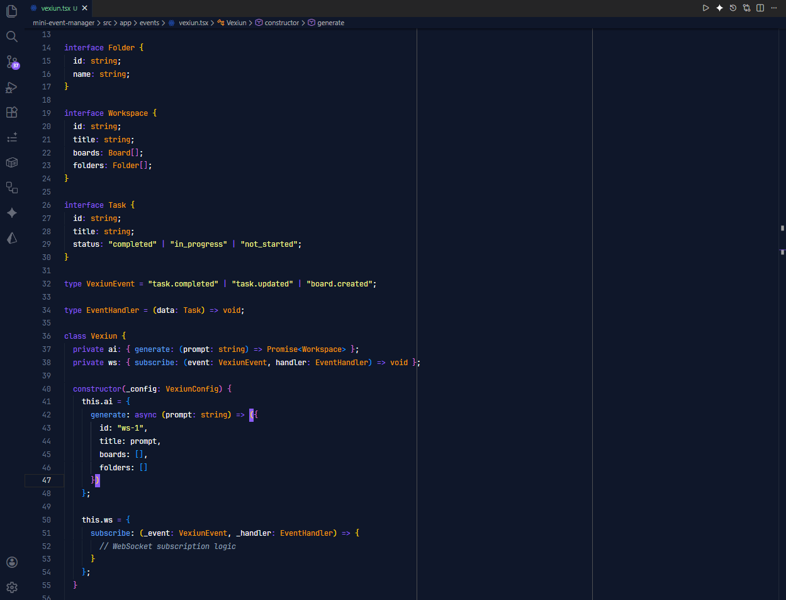
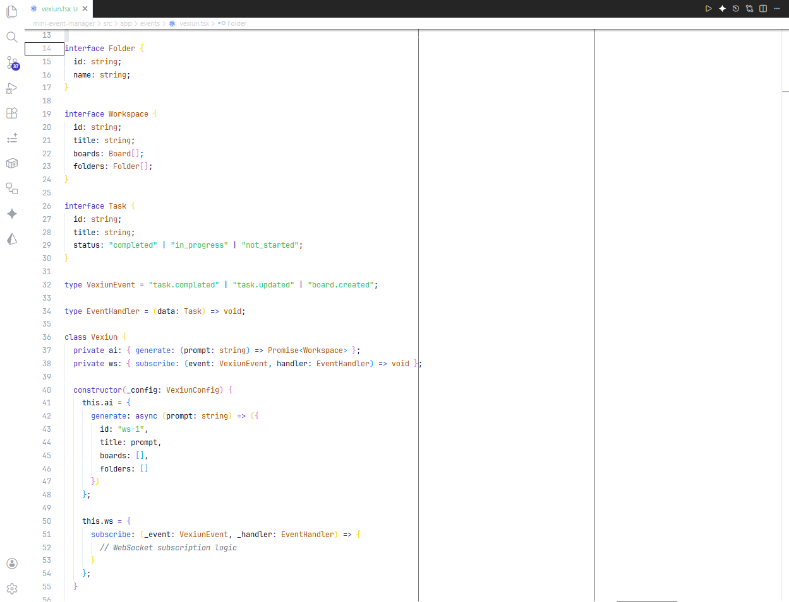

# Vexiun Theme Pack for Visual Studio Code

This extension provides a collection of custom themes for Visual Studio Code.

## Available Themes

### Vexiun Gray

### Vexiun Zinc

### Vexiun Purple

### Vexiun Sakura

### Vexiun Strawberry

### Vexiun Dark

### Vexiun Light

## Installation

1.  Open the **Extensions** sidebar in VS Code.
2.  Search for `Vexiun Theme`.
3.  Click **Install**.
4.  Open the **Command Palette** (`Ctrl+Shift+P` or `Cmd+Shift+P` on macOS).
5.  Search for `Preferences: Color Theme` and select it.
6.  Choose one of the `Vexiun` themes from the list.

## For More Information

- [Visual Studio Code Themes](https://code.visualstudio.com/docs/getstarted/themes)
- [Markdown Syntax Reference](https://help.github.com/articles/markdown-basics/)

**Enjoy!**
